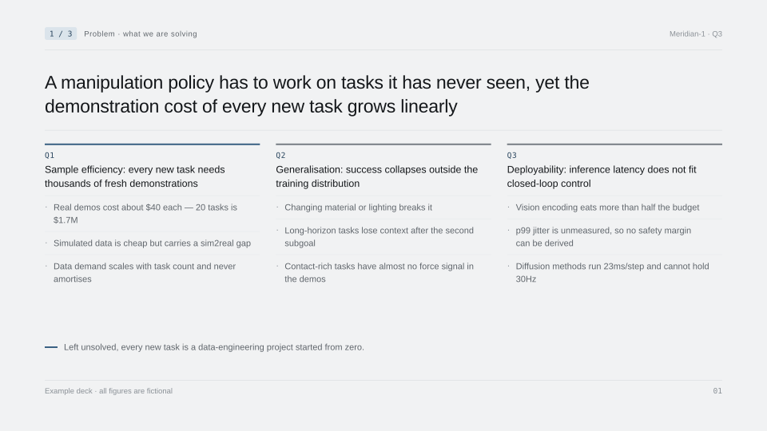
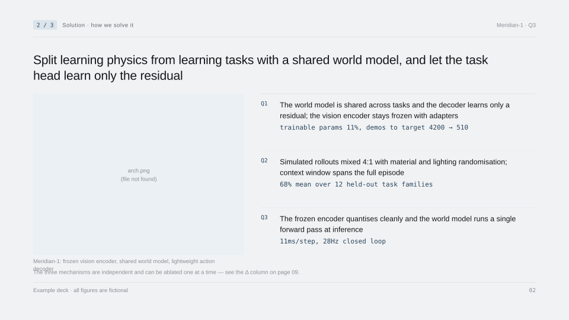
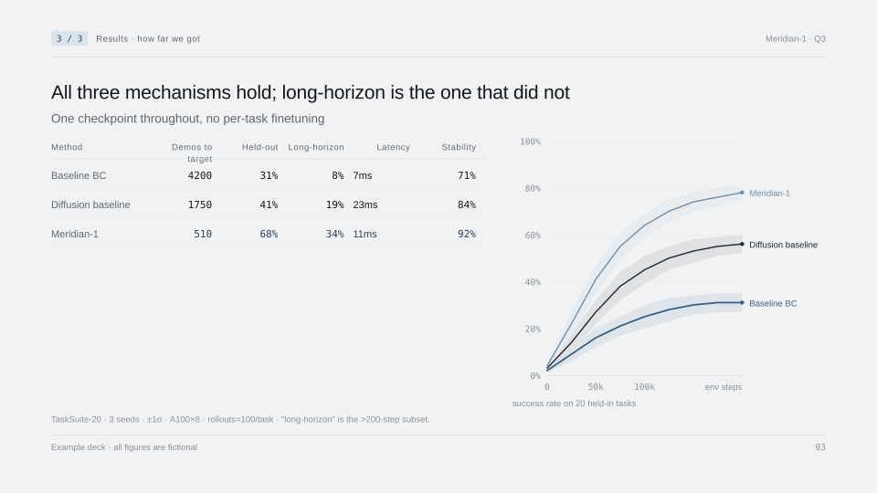
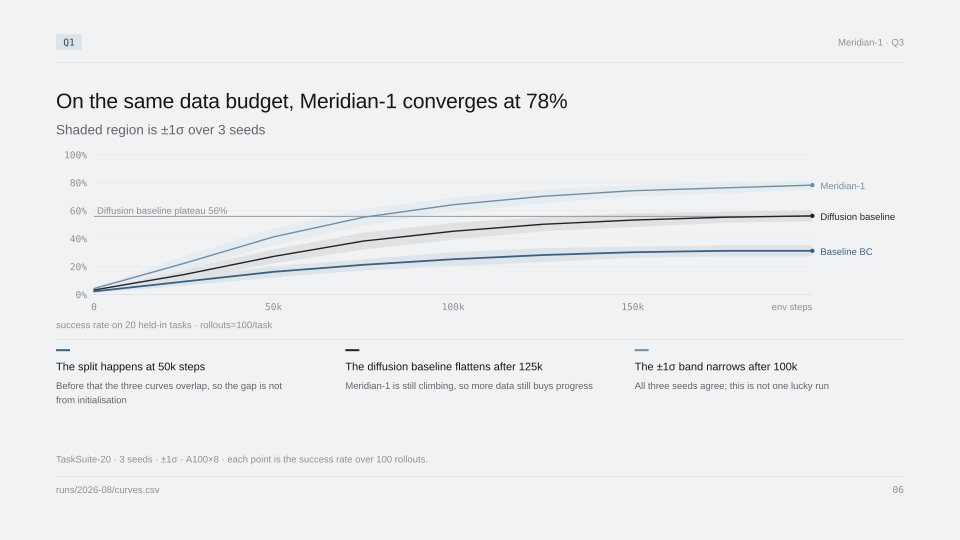
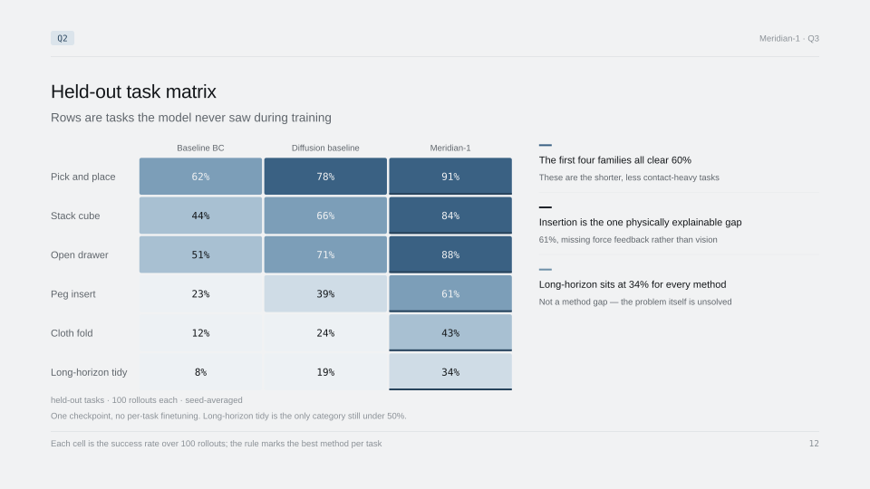
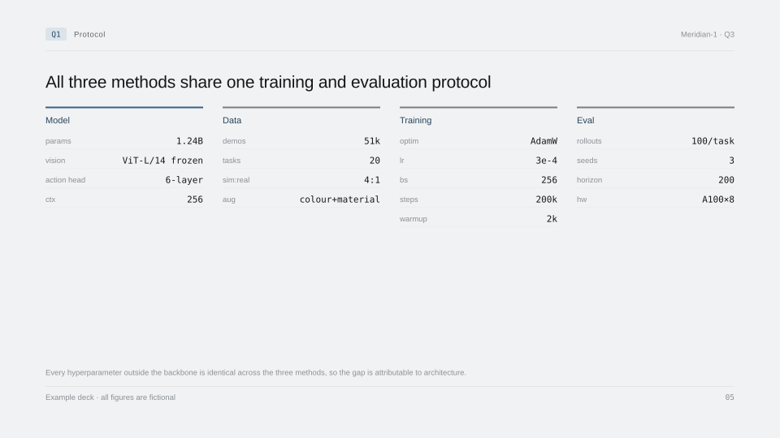

# Sample pages

Six pages from [`meridian-1.en.md`](../meridian-1.en.md), rendered by the reference implementation in `tools/deck-renderer`. Figures are fictional.

Rendered as SVG so the geometry is exact. The typeface falls back to your system sans unless IBM Plex is installed, so the letterforms here are not what a real deck looks like — everything else is.

---

## The front three carry the whole argument

### 1 · Problem — one big problem, split into Q1…Q3



Each column is a mid-level problem with two or three measurable obstacles beneath it. Not "generalisation is insufficient" but "changing material or lighting breaks it". Every evidence page later in the deck declares which of these it supports.

### 2 · Solution — one row per problem



One row per Q from the previous page, each with the mechanism and its key number. A Q with no row means the solution does not cover a problem you raised.

### 3 · Results — including what is not solved



A method-by-metric table, not a wall of numbers. The long-horizon column sits at 34% and stays on the table; removing it would turn the page into marketing.

---

## Evidence pages

### Analysis below, when the figure needs the width



Nine x ticks, so the chart keeps the full width and the three analysis lines go underneath. Shaded bands are ±1σ across seeds; the reference line is the baseline's plateau; the footnote carries the conditions.

The title states the conclusion. The analysis states how the figure gets you there — those are different, and both are required.

### Analysis on the right, when it does not



Three columns, so the matrix keeps its full height and the analysis moves beside it. This is chosen automatically from how many horizontal slots the figure actually needs; a three-column matrix squashed to 62% height for no reason is the thing this avoids.

### The density signature



Every hyperparameter that separates the arms, values monospaced and right-aligned. This is the page that makes a deck legible to someone who wants to check your work rather than believe it.

---

## Reproducing these

```bash
cd tools/deck-renderer
python3 -m venv .venv && .venv/bin/pip install -r requirements.txt
.venv/bin/python -m deckkit.build examples/meridian-1.en.md -o out/deck.pptx --preview
```

`out/preview.en.html` shows all 22 pages with the real typefaces, pulled from Google Fonts. `out/deck.pptx` opens in Keynote and PowerPoint.
